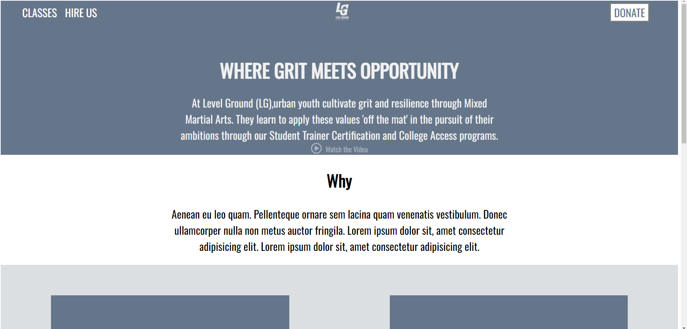

# level-ground
My attempt at recreating level-ground

#### 

## How it's Made:
Tech used: HTML, CSS

I used HTML & CSS to Structure & CSS to structure the site & made the site responsive

## Optimizations
I'd like to go back and redo the site using Flex & make the transitions for some of the content decisions alot smoother

## Lessons Learned
I really solidified my understanding of media querys with this site & how responsiveness affects the sites layouts for multiple devices

## Example
Take a look at these example that i have below:

